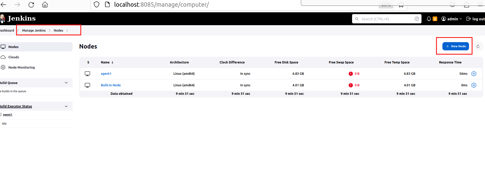
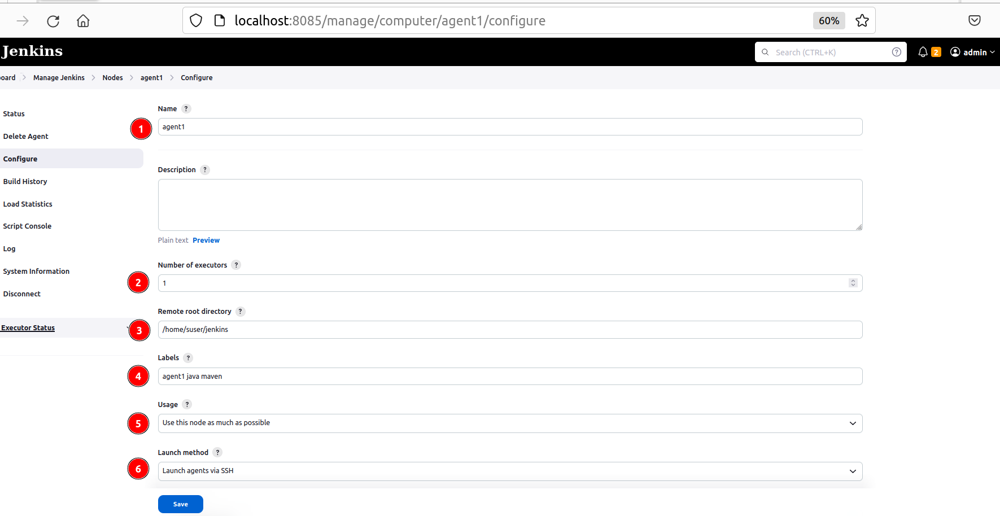
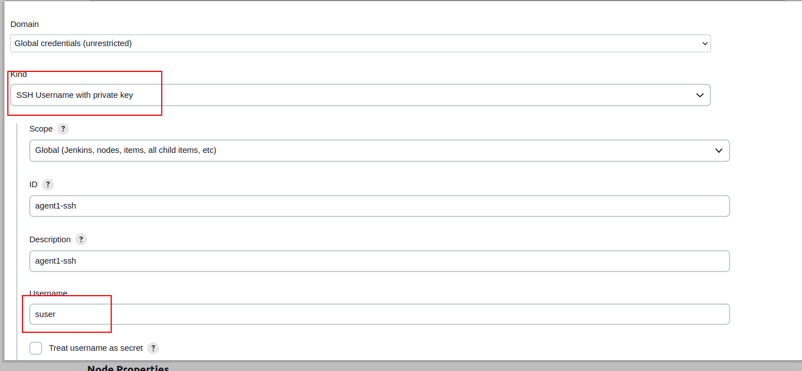
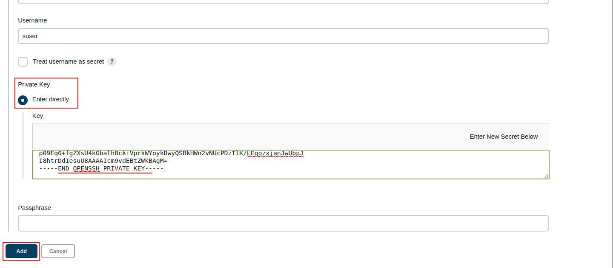
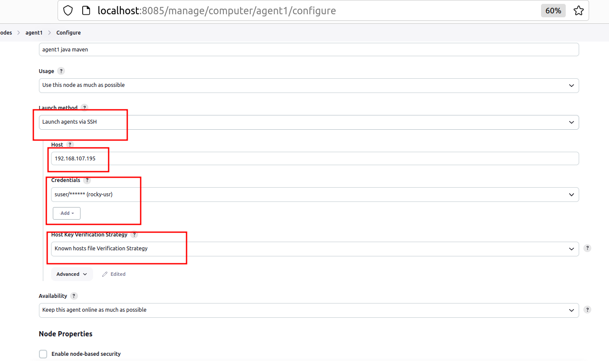
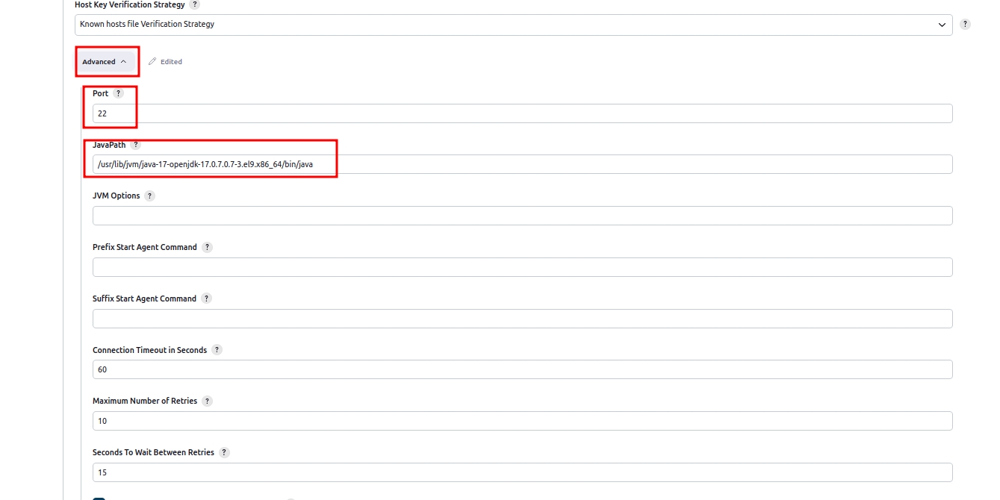
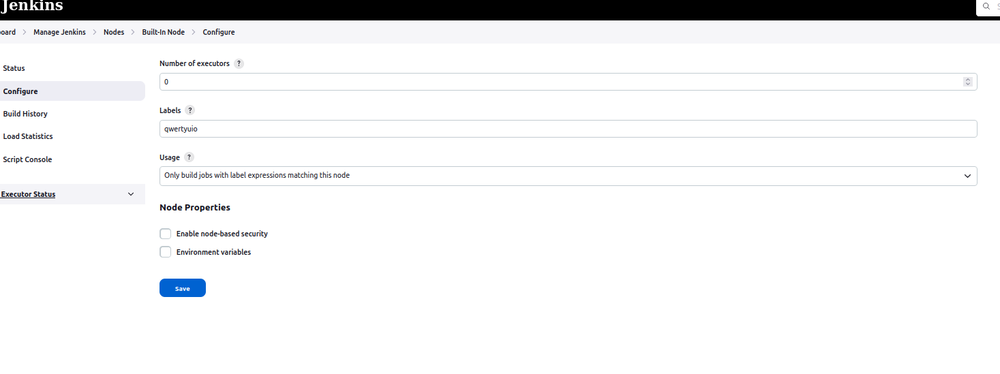

## This ansible playbook installs [`Jenkins`](https://www.jenkins.io/doc/) on specified host ##

# Prerequisites

* Run the ansible playbook on `Debian` or `Ubuntu`. [We used VM with Jammy Ubuntu](https://github.com/Alliedium/awesome-proxmox). Use the [script](https://github.com/Alliedium/awesome-proxmox/blob/main/vm-cloud-init-shell/.env.example) to create VM on `Proxmox`.  
* Install Ansible: [Follow the second step](https://github.com/Alliedium/awesome-ansible#setting-up-config-machine)
* Use `$HOME/awesome-jenkins/inventory/localhost/hosts.yaml` if you are installing the `Jenkins` on the same host where `Ansible` is running.  Use `$HOME/awesome-jenkins/inventory/example/hosts.yaml` if you are installing the `Jenkins` on the remote host.
  
  In our examples, we use `$HOME/awesome-jenkins/inventory/localhost/hosts.yaml` file.

* [Install `molecule`](https://molecule.readthedocs.io/installation/) on `Ubuntu` Linux. Molecule project is designed to aid in the development and testing of Ansible roles.
  
```shell
   apt update
```
```shell
   apt install pip
```
```shell
   python3 -m pip install molecule ansible-core
```
```shell
   pip3 install 'molecule-plugins[docker]' 
```

## Playbook variables used in Jenkins server installation:

1. The HTTP port for `Jenkins` web interface:

   ```yaml
   jenkins_http_port: 8085
   ```

2. Admin account credentials which will be created the first time `Jenkins` is installed:

   ```yaml
   jenkins_admin_username: admin
   jenkins_admin_password: admin
   ```

3. Java version:
   
   ```yaml
   java_packages: 
     - openjdk-17-jdk
   ```

4. Install global tools. Maven versions:
    
   ```yaml
   jenkins_maven_installations:
     - 3.8.4
     - 3.9.0
   ```

5. [List of plugins that will be installed](ListofJenkinsPluginsToBeInstalled.md)

6. Multibranch pipeline job's repository url. Please change this parameter to the url of your fork:

   ```yaml
   multibranch_repository_url: "https://github.com/Alliedium-demo-test/springboot-api-rest-example.git"
   ```


## Instructions to install `Jenkins` with ansible-playbook

### 1. Clone repo:

  ```shell
  git clone https://github.com/Alliedium/awesome-jenkins.git $HOME/awesome-jenkins
  ```
### 2. Install `Jenkins` on remote host

* Copy `$HOME/awesome-jenkins/inventory/example` to `$HOME/awesome-jenkins/inventory/my-jenkins` folder.
  
  ```shell
  cp -r $HOME/awesome-jenkins/inventory/example $HOME/awesome-jenkins/inventory/my-jenkins
  ```

* Change the variables in the files `$HOME/awesome-jenkins/inventory/my-jenkins/hosts.yml` as you need


* Installing `Jenkins` on localhost does not require any changes to `$HOME/awesome-jenkins/inventory/localhost/hosts.yml` file.

### 3. Install ansible roles for [Java](https://github.com/geerlingguy/ansible-role-java/), [Git](https://github.com/geerlingguy/ansible-role-git/), and [Jenkins](https://github.com/geerlingguy/ansible-role-jenkins) using commands:
   
   ```shell
   ansible-galaxy install -r $HOME/awesome-jenkins/requirements.yml
   ```

### 4. Run ansible-playbook 

   This playbook contains multiple tasks that install `git`, `java`, `Jenkins`, as well as plugins, tools, and pipelines in `Jenkins`. Using `Ansible` tags you can run a part of tasks. In our playbook we use 8 tags: `always`, `step1`, `step2`, `step3`, `step4`, `step5`, `step6`, and `step7`. Use the `-t <tag_name>` flag to specify the desired tag. They form a hierarchy of tags from `always` to `step6`. In this hierarchy, each subsequent tag includes both the tasks marked by this tag as well as tasks relating to all preceding tags, except `step1`, e.g., if you run the playbook with `step3` tag, all tasks with tags `always`, `step2` and `step3` will be run. Tag `step7` does not include all previous steps, it includes only tags `always`, `step2`, and `step3`, because `Input job` needs no plugins or tools. However, run of this tag will not remove any installed tool or plugin.            

   1. Before running tasks, check the list of tasks that will be executed using `--list-tasks` flag
   
   ```shell
   ansible-playbook $HOME/awesome-jenkins/playbooks/create-job.yml -i $HOME/awesome-jenkins/inventory/localhost --list-tasks
   ```

   You will receive a list of all tasks. Using `-t step2` when getting a list of tasks.

   ```shell
   ansible-playbook $HOME/awesome-jenkins/playbooks/create-job.yml -i $HOME/awesome-jenkins/inventory/localhost -t step2 --list-tasks
   ```

   You will receive a list of tasks, tagged `always`, `step1` and `step2`.

   2. Run all the available tasks from `playbook.yml` playbook. 
   
   ```shell
   ansible-playbook $HOME/awesome-jenkins/playbooks/create-job.yml -i $HOME/awesome-jenkins/inventory/localhost
   ```
   3. Run without installing any plugins in `Jenkins`:
   
   ```shell
   ansible-playbook $HOME/awesome-jenkins/playbooks/create-job.yml -i $HOME/awesome-jenkins/inventory/localhost -t step1
   ```

   4. Run with installing [plugins](ListofJenkinsPluginsToBeInstalled.md) in `Jenkins`:
   
   ```shell
   ansible-playbook $HOME/awesome-jenkins/playbooks/create-job.yml -i $HOME/awesome-jenkins/inventory/localhost -t step2
   ```

   5. Use `step3` tag - install `python-jenkins`
   
   ```shell
   ansible-playbook $HOME/awesome-jenkins/playbooks/create-job.yml -i $HOME/awesome-jenkins/inventory/localhost -t step3
   ```

   6. `step4` - Add  `maven` tool
   
   ```shell
   ansible-playbook $HOME/awesome-jenkins/playbooks/create-job.yml -i $HOME/awesome-jenkins/inventory/localhost -t step4
   ```

   7. `step5` - Create and launch  `Jenkins pipeline job`
   
   ```shell
   ansible-playbook $HOME/awesome-jenkins/playbooks/create-job.yml -i $HOME/awesome-jenkins/inventory/localhost -t step5
   ```
   
   8. `step6` - Create and launch `Jenkins multibranch pipeline job`
   
   ```shell
   ansible-playbook $HOME/awesome-jenkins/playbooks/create-job.yml -i $HOME/awesome-jenkins/inventory/localhost -t step6
   ```
   9. `step7` -  Create `Jenkins pipeline for input job`. 

      ```shell
      ansible-playbook $HOME/awesome-jenkins/playbooks/create-job.yml -i $HOME/awesome-jenkins/inventory/localhost -t step7
      ```

### 5. Check `Jenkins`
1. Go to the host specified in the `$HOME/awesome-jenkins/inventory/localhost/hosts.yml` file, open the browser, and check that `Jenkins` is available at http://localhost:8085/.
2. Login to `Jenkins` using the credentials.
3. You will see `Jenkins` dashboard. Open job.  
4. The main branch will be run for the single pipeline job 
5. Pull requests will be run for the multibranch pipeline job.

### 5. Ansible playbook local testing with [molecule](https://molecule.readthedocs.io/)

The `molecule` configuration files are located in the `$HOME/awesome-jenkins/molecule/default` folder.

`molecule.yml` - this is the core file for Molecule. Used to define your testing steps, scenarios, dependencies, and other configuration options.

`converge.yml` - this is the playbook that Molecule will run to provision the targets for testing.

`verify.yml` - this is the playbook that is used to validate that the already converged instance state matches the desired state. 

Before running the `molecule` command, go to `awesome-jenkins` project

```
cd $HOME/awesome-jenkins
```

* Run Ansible playbook test after which all previously created resources are deleted.
  
```
molecule test
```

The `test` command will run the entire scenario; creating, converging, verifying.

* Ansible playbook execution or role in target infrastructure, without testing. In this case, molecule will run the Ansible playbook in docker
  
```
molecule converge
```

* Run Ansible playbook test after the infrastructure has been converged using the "molecule converge" command. All previously created resources are not deleted
  
```
molecule verify
```

* Navigate to the target infrastructure - the docker container with the debug or check target

```
molecule login
```

* Reset molecule temporary folders.

```
molecule reset
```

* Finally, to clean up, we can run

```shell
molecule destroy
```

This removes the containers that we deployed and provisioned with create or converge. Putting us into a great place to start again.

### 6. Ansible playbook remote testing with GitHub Actions

The `$HOME/awesome-jenkins/.github/workflows/ci.yml` file describes the steps for `GitHub` Actions testing.     

After creating or updating a pull request, tests are launched on the `GitHub` server and the results can be viewed here       

         
 
       

## `Jenkins` and `GitHub` integration

We used the following [project](https://github.com/Alliedium/springboot-api-rest-example) as an example      
Job configuration is set in the `templates/multibranch-pipeline-config.xml.j2`

1. Set Resource Root URL     
     
2. Creating your organization in `GitHub`      

            

3. Fork your repo for testing purposes on `GitHub`         
     

4. Creating `GitHub apps`       

     

5. Generate and download SSH key     
     
   
6. Install your app for repositories      
    

7. Convert your generated key     
`<key-in-your-downloads-folder>` - path to your generated SSH key     
`file-name-private-key.pem` - file with generated SSH key     
`<key-in-your-downloads-folder>` - path to a converted key      
`converted-github-app.pem` -  file with a converted key     
```shell
openssl pkcs8 -topk8 -inform PEM -outform PEM -in <key-in-your-downloads-folder>/file-name-private-key.pem -out <key-in-your-downloads-folder>/converted-github-app.pem -nocrypt
```       
8. Create `multibranch pipeline` in `Jenkins`     

     

9. Configure `multibranch pipeline`   
       

10. On `GitHub` create new branch and pull request     
After creating new pull request on `Jenkins` scan repository      

      

10. Run your build      
     

11. See build result on `GitHub`     
      

## Create Jenkins node on VM
### Prerequisite: 
  [Use VM with Rocky9.2](https://github.com/Alliedium/awesome-proxmox). Use the [script](https://github.com/Alliedium/awesome-proxmox/blob/main/vm-cloud-init-shell/.env.example) to create VM on `Proxmox`.
  Connect to **your VM** via ssh and enter password:
   ```shell
   ssh <username>@<vm_ip_address>
   ```
###   Next steps should be executed on Jenkins node VM
1. Install git
   ```shell
   sudo dnf install git
   ```
2. Install java 17 and make it default
   ```shell
   sudo dnf install java-17-openjdk java-17-openjdk-devel
   ```
   ```shell
   java -version
   ```
   ```shell
   alternatives --list
   ```
   ```shell
   sudo alternatives --config java
   ```
   ```shell
   java -version
   ```
3. Create directory <agent_jenkins_dir> for Jenkins on your VM. In this directory the Jenkins associated files (settings, jobs) will be stored.
   ```shell
   mkdir <agent_jenkins_dir>
   ```

### Do on your Jenkins controller machine
1. Navigate to
   ```shell
    cd /var/lib/jenkins
   ```
2. Create directory
   ```shell
   mkdir ./ssh
   ```
3. Change its owner
   ```shell
   sudo chown -R jenkins:jenkins /var/lib/jenkins/.ssh
   ```
4. Change user to `jenkins`
   ```shell
   sudo su jenkins
   ```
5. Create file `known_hosts`
   ```shell
   touch ./.ssh/known_hosts
   ```
6. Add `VM` to the `known_hosts`
   ```shell
   ssh-keyscan host <your_vm_ip> >> /var/lib/jenkins/.ssh/known_hosts
   ```
7. Go to your Jenkins. Open Manage Jenkins => Nodes 



8. Configure your Jenkins agent-node:

  Write `Name` (1), indicate `Number of runners` (2), `Remote root directory` should be the same as in the p.5 (3), add `Labels` that will trigger your agent (4); select type of `Usage` (5); choose launch method via SSH



  Create credentials. Choose kind `SSH Username with private key`. Use username from your VM machine.


  
  Enter directly private key from your VM. Use key for ssh access generated on VM creation. 



  Indicate IP address of your VM machine and add credentials for it; set `Host Key Verification Strategy` to `Known hosts file verification strategy`


  
  Go to Advanced settings and set path to your JVM:



9. Disable agent on your Jenkins controller


  
  Set number of runners to `0`



#### Create Jenkins input job

1. On your host machine go to the directory with `awesome-jenkins` project

   ```shell
   cd $HOME/awesome-jenkins
   ```

2. Run `step7` from ansible playbook - Create and launch `Jenkins pipeline input job`.  

   ```shell
   ansible-playbook $HOME/awesome-jenkins/playbooks/create-job.yml -i $HOME/awesome-jenkins/inventory/localhost -t step7
   ```
3. Open Jenkins in your browser: `127.0.0.1:8085`
4. Go to the `pipeline-input-job` and run the build. It will stop after some seconds.
5. Connect to your VM machine with Jenkins node
6. Go to the repository <agent_jenkins_dir> set for Jenkins 
   ```shell
   cd <agent_jenkins_dir>
   ```
7. Explore it. Your may found installed tools in the `tools` directory
8. Your job workspaces is in the `workspaces/pipeline-input-job` directory
9. After exploring go back to Jenkins on your VM machine and input any name to continue the build.

## References

#### Ansible roles used in playbook
1. [Ansible galaxy Java role](https://github.com/geerlingguy/ansible-role-java/)
2. [Ansible galaxy Git role](https://github.com/geerlingguy/ansible-role-git/)
3. [Ansible galaxy Jenkins role](https://github.com/geerlingguy/ansible-role-jenkins)

#### GitOps workflow
4. [DevOps guide: pipeline challenges latest trends](https://www.polestarllp.com/blog/devops-guide-pipeline-challenges-latest-trends)
5. [Gitflow workflow](https://www.atlassian.com/git/tutorials/comparing-workflows/gitflow-workflow)
6. [GitOps principles](https://rafay.co/the-kubernetes-current/gitops-principles-and-workflows-every-team-should-know/)

#### Maven profiles
7. [Maven profiles documentation](https://maven.apache.org/guides/introduction/introduction-to-profiles.html)
8. [Maven profiles guide](https://www.baeldung.com/maven-profiles)
9. [Maven profiles. Examples](https://medium.com/javarevisited/maven-profiles-detailed-explanation-1b4c8204466a)

#### CI/CD
10. [CI/CD basics](https://www.synopsys.com/glossary/what-is-cicd.html)
11. [CI/CD basics](https://www.redhat.com/en/topics/devops/what-is-ci-cd)
12. [CI/CD fundamentals](https://about.gitlab.com/topics/ci-cd/)

#### CI/CD Tools
13. [CI/CD tools review](https://testsigma.com/blog/ci-cd-tools/)
14. [Jenkins vs Jenkins X](https://www.educative.io/answers/what-is-the-difference-between-jenkins-and-jenkins-x)
15. [Jenkins user documentation](https://www.jenkins.io/doc/)
16. [Jenkins X](https://jenkins-x.io/)
17. [GitHub actions docs](https://docs.github.com/en/actions)
18. [Argo Workflows - The workflow engine for Kubernetes](https://argoproj.github.io/argo-workflows/)
19. [Tekton - Cloud Native CI/CD](https://tekton.dev/)
20. [GitLab CI/CD docs](https://docs.gitlab.com/ee/ci/)

#### Jenkins pipelines
21. [Jenkins pipelines](https://www.jenkins.io/doc/book/pipeline/getting-started/) 
22. [Jenkinsfile](https://www.jenkins.io/doc/book/pipeline/jenkinsfile/)
23. [Jenkins pipeline syntax](https://www.jenkins.io/doc/book/pipeline/syntax/)
24. [Pipeline stage view Jenkins plugin](https://plugins.jenkins.io/pipeline-stage-view/)
25. [Rendering User Content](https://www.jenkins.io/doc/book/security/user-content/)

#### Debugging Jenkins pipeline
26. [Jenkins script console](https://www.jenkins.io/doc/book/managing/script-console/)
27. [Debugging Jenkins pipeline](https://notes.asaleh.net/posts/debugging-jenkins-pipeline/)
28. [Debugging tips](https://dzone.com/articles/10-tips-to-debug-jenkins-pipelines)
29. [Testing framework for Jenkins pipelines](https://github.com/jenkinsci/JenkinsPipelineUnit)

#### Static code analysis
30. [Spotbugs maven plugin](https://spotbugs.github.io/spotbugs-maven-plugin/)
31. [PMD/CPD static analysis plugin](https://pmd.github.io/latest/pmd_userdocs_tools_maven.html)
32. [Checkstyle plugin](https://checkstyle.org/)
33. [Code coverage tools](https://www.softwaretestinghelp.com/code-coverage-tools/style)
34. [Comparison of findbugs, pmd and checkstyle](https://www.sw-engineering-candies.com/blog-1/comparison-of-findbugs-pmd-and-checkstyle)
35. [Spotbugs docs](https://spotbugs.readthedocs.io/en/stable/introduction.html)
36. [Spotbugs maven plugin docs](https://spotbugs.readthedocs.io/en/stable/maven.html)
37. [Code style analysis reports publisher on Jenkins](https://plugins.jenkins.io/warnings-ng/)
38. [Code coverage tools](https://www.softwaretestinghelp.com/code-coverage-tools/)
39. [Jacoco documentation](https://www.eclemma.org/jacoco/trunk/doc/maven.html)[Jacoco examples](https://www.baeldung.com/jacoco)
40. [Jacoco examples](https://www.baeldung.com/jacoco)
41. [Code coverage reports publisher on Jenkins](https://plugins.jenkins.io/htmlpublisher/)

#### Jenkins and GitHub integration
42. [GitHub checks Jenkins plugin](https://plugins.jenkins.io/github-checks/)
43. [Disable GitHub multibranch status Jenkins plugin](https://plugins.jenkins.io/disable-github-multibranch-status/)
44. [How to integrate Jenkins with GitHub](https://docs.cloudbees.com/docs/cloudbees-ci/latest/cloud-admin-guide/github-app-auth)
45. [How to create GitHub App](https://docs.github.com/en/apps/creating-github-apps/setting-up-a-github-app/creating-a-github-app)
46. [Manage protected branches on GitHub](https://docs.github.com/en/repositories/configuring-branches-and-merges-in-your-repository/managing-protected-branches)
47. [Setup GitHub checks in Jenkinsfile](https://github.com/jenkinsci/checks-api-plugin/blob/master/docs/consumers-guide.md)

#### Jenkins nodes
48. [How to configure Jenkins master and slave nodes](https://digitalvarys.com/how-to-configure-jenkins-master-slave-setup/)
49. [Jenkins ssh-slaves plugin](https://plugins.jenkins.io/ssh-slaves/)
50. [Managing Jenkins nodes](https://www.jenkins.io/doc/book/managing/nodes/)
51. [Video: Jenkins node setup](https://www.youtube.com/watch?v=99DddJiH7lM)

#### Manage Jenkins users
52. [Matrix authorization strategy Jenkins plugin](https://plugins.jenkins.io/matrix-auth/)
53. [Role strategy Jenkins plugin](https://plugins.jenkins.io/role-strategy/)
54. [Login to Jenkins using your own, self-hosted or public openid connect server](https://plugins.jenkins.io/oic-auth/)
55. [How to reset Jenkins admin password](https://tecadmin.net/reset-jenkins-admin-password/)

#### GitHub Actions
56. [GitHub Actions workflows](https://docs.github.com/en/actions/using-workflows/about-workflows)
57. [GitHub Actions workflows basics, examples and a quick tutorial](https://codefresh.io/learn/github-actions/github-actions-workflows-basics-examples-and-a-quick-tutorial/)