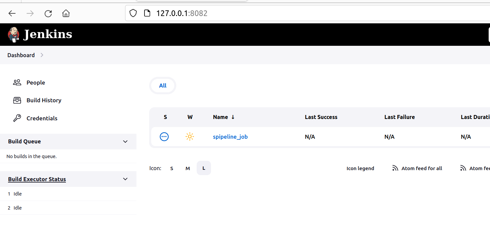

## This ansible playbook installs [`Jenkins`](https://www.jenkins.io/doc/) on specified host ##

# Prerequisites
* Run the ansible playbook on `Debian` or `Ubuntu`. [Used was VM with Jammy Ubuntu](https://github.com/Alliedium/awesome-proxmox). Use the [script](https://github.com/Alliedium/awesome-proxmox/blob/main/vm-cloud-init-shell/.env.example) to create VM on `Proxmox`.  

* Install Ansible: [Follow the second step](https://github.com/Alliedium/awesome-ansible#setting-up-config-machine)

* [Install `molecule`](https://molecule.readthedocs.io/installation/) on `Ubuntu` Linux. Molecule project is designed to aid in the development and testing of Ansible roles.
  
   ```
   apt update
   apt install pip
   python3 -m pip install molecule ansible-core
   pip3 install 'molecule-plugins[docker]'
   ```

## Playbook variables used in Jenkins server installation:

1. The HTTP port for Jenkins' web interface:

   ```
   jenkins_http_port: 8085
   ```

2. Admin account credentials which will be created the first time Jenkins is installed: - check users in role

   ```
   jenkins_admin_username: admin
   jenkins_admin_password: admin
   ```

3. Java version:
   
   ```   
   java_packages: 
      - openjdk-17-jdk
   ```

4. Install global tools. Maven versions:
    
   ```
   jenkins_maven_installations:
     - 3.8.4
     - 3.9.0
   ```

5. [List of plugins that will be installed](ListofJenkinsPluginsToBeInstalled.md)

## Instructions to install Jenkins with ansible playbook

### 1. Clone repo and navigate to `awesome-jenkins` project:

  ```
  git clone https://github.com/Alliedium/awesome-jenkins.git $HOME/awesome-jenkins
  cd $HOME/awesome-jenkins
  ```

### 2. Install ansible roles for [Java](https://github.com/geerlingguy/ansible-role-java/), [Git](https://github.com/geerlingguy/ansible-role-git/), and [Jenkins](https://github.com/geerlingguy/ansible-role-jenkins) using commands:
   
   ```
   ansible-galaxy install -r ./requirements.yml
   ```

### 3. Run ansible playbook 

  This playbook contains multiple tasks that install `git`, `java`, `Jenkins`, as well as plugins, tools and pipelines in `Jenkins`. Using `Ansible` tags you can run a part of tasks. In our playbook we use 7 tags: `always`, `step1`, `step2`, `step3`, `step4`, `step5` and `step6`. Use `-t <tag_name>` flag to specify desired tag. They form a hierarchy of tags from `always` to `step6`. In this hierarchy, each subsequent tag includes both the tasks marked by this tag as well as tasks relating to all preceding tags, e.g. if you run playbook with `step3` tag, tasks tagged with `always`, `step1`, `step2` and `step3` will be run.

   1. Before running tasks, check the list of tasks that will be executed using `--list-tasks` flag
   
   ```
   ansible-playbook ./playbooks/create-job.yml -i ./inventory --list-tasks
   ```

   You will receive a list of all tasks. Using `-t step2` when getting a list of tasks.

   ```
   ansible-playbook ./playbooks/create-job.yml -i ./inventory -t step2 --list-tasks
   ```

   You will receive a list of tasks, tagged `always`, `step1` and `step2`.


   2. Run all the available tasks from `playbook.yml` playbook. 
   
   ```
   ansible-playbook ./playbooks/create-job.yml -i ./inventory
   ```
   3. Run without installing any plugins in `Jenkins`:
   
   ```
   ansible-playbook ./playbooks/create-job.yml -i ./inventory -t step1
   ```

   4. Run with installing [plugins](ListofJenkinsPluginsToBeInstalled.md) in `Jenkins`:
   
   ```
   ansible-playbook ./playbooks/create-job.yml -i ./inventory -t step2
   ```

   5. Use `step3` tag - install `python-jenkins`
   
   ```
   ansible-playbook ./playbooks/create-job.yml -i ./inventory -t step3
   ```

   6. `step4` - Add  `maven` tool
   
   ```
   ansible-playbook ./playbooks/create-job.yml -i ./inventory -t step4
   ```

   7. `step5` - Create and launch  `Jenkins pipeline job`
   
   ```
   ansible-playbook ./playbooks/create-job.yml -i ./inventory -t step5
   ```
   
   8. `step6 - Create and launch  `Jenkins multibranch pipeline job`
   
   ```
   ansible-playbook ./playbooks/create-job.yml -i ./inventory -t step6
   ```

### 4. Check `Jenkins`

1. Go to the host specified in the `inventory/hosts.yml` file, open browser and check that Jenkins is available at http://localhost:8085/.
2. Login to Jenkins using the credentials.
3. You will see Jenkins dashboard. Open job.  
4. The main branch will be run for the single pipeline job 
5. Pull requests will be run for the multibranch pipeline job.

## Project:
   As the example we used the following [project](https://github.com/Alliedium/springboot-api-rest-example)

## Job configuration:
   Job configuration is set in the `templates/job-config.xml.j2` and `templates/job-config-2.xml.j2`.
