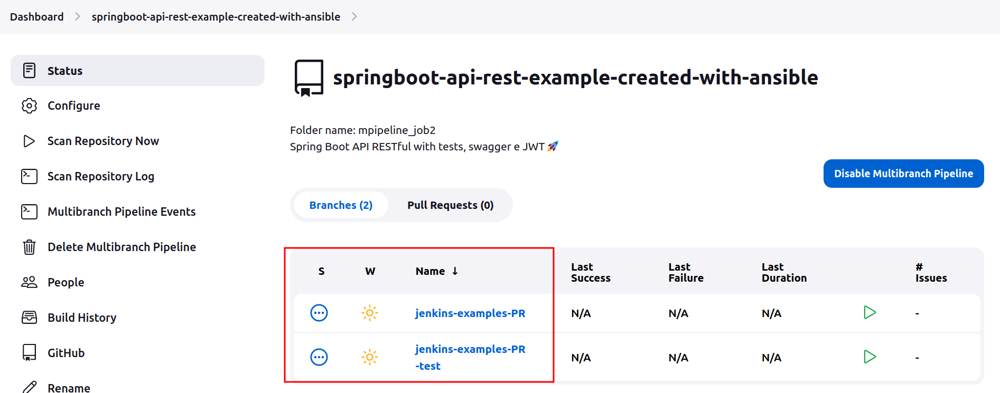

# Install Jenkins with plugins, create multibranch with ansible-playbook on Linux ubuntu
##Jenkins server:
*   Jenkins host will be set as _127.0.0.1_ and port _8081_- [local Jenkins](http://127.0.0.1:8081)
*   Default jdk will be - _openjdk-17-jdk_
*   Your credentials for Jenkins will be username/password -  _admin/admin_
*   Maven version that will be installed - _3.8.7_
*   [List of plugins that will be installed](ListofJenkinsPluginsToBeInstalled.md)
##Project and job:
*  As the example we used the following [project](https://github.com/Alliedium/springboot-api-rest-example)
*  Jenkinsfile location for our job will be _jenkins/Jenkinsfile_

# Instructions to install Jenkins with ansible playbook:
1. Install ansible roles  by running following commands:
    `ansible-galaxy install --roles-path=./playbooks geerlingguy.jenkins`
    `ansible-galaxy install --roles-path=./playbooks geerlingguy.java`
2. Run ansible playbook to install Jenkins and create job:
    `ansible-playbook ~/ansible-jenkins/playbooks/create-job.yml -i ./inventory`
3. Go to the browser and check that Jenkins is available at http://localhost:8081/.
4. Login to Jenkins using the credentials.
5. You will see Jenkins dashboard . Open job.
6. The branches that have Jenkinsfile in the indicated location _jenkins/Jenkinsfile_ will appear in your build 