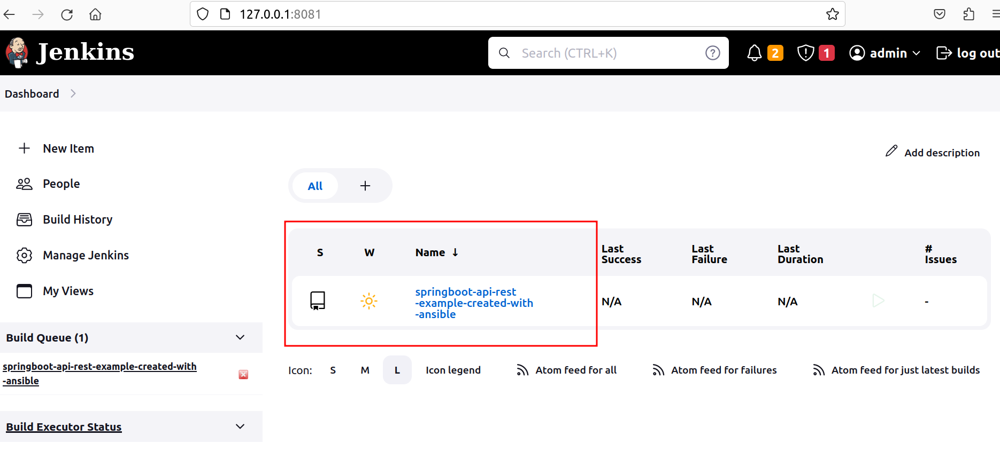

# Install Jenkins with plugins, create multibranch with ansible-playbook on Linux ubuntu

## Playbook variables used in Jenkins server installation:
1. Jenkins host:
    `jenkins_hostname: 127.0.0.1`
2. Jenkins port: 
    `jenkins_port: 8082`
3.  Admin account credentials which will be created the first time Jenkins is installed: - check users in role
    `jenkins_admin_user: admin
     jenkins_admin_password: admin`
4. Java version:
    `java_packages:`
      `- openjdk-17-jdk`
5. Install global tools. Maven versions:
*     jenkins_maven_installations:
      - 3.8.4
      - 3.9.0
6. [List of plugins that will be installed](ListofJenkinsPluginsToBeInstalled.md)

# Instructions to install Jenkins with ansible playbook:
1. Install ansible roles for [Jenkins](https://github.com/geerlingguy/ansible-role-jenkins) and [Java](https://github.com/geerlingguy/ansible-role-java/) using commands:
    `ansible-galaxy install --roles-path=./playbooks geerlingguy.jenkins`
    `ansible-galaxy install --roles-path=./playbooks geerlingguy.java`
2. Run ansible playbook to install and config Jenkins server and create job:
    `ansible-playbook ~/ansible-jenkins/playbooks/create-job.yml -i ./inventory`
3. Go to the browser and check that Jenkins is available at http://localhost:8082/.
4. Login to Jenkins using the credentials.
5. You will see Jenkins dashboard. Open job.  
6. The main branch will be run 

### Project:
   As the example we used the following [project](https://github.com/Alliedium/springboot-api-rest-example)
### Job configuration:
   Job configuration is set in the templates/job-config.xml.j2.